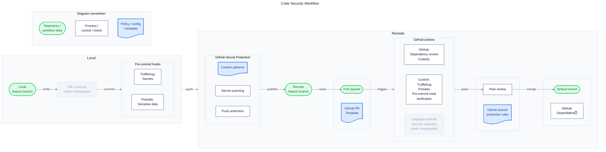

```mermaid
---
title: Code Security Workflow
config:
  theme: 'base'
  themeVariables:
    primaryColor: '#ffffff'
    primaryBorderColor: '#334155'
    clusterBkg: '#f8fafc'
    clusterBorder: '#cbd5e1'
    lineColor: '#64748b'
    textColor: '#0f172a'
---
flowchart LR

 subgraph preCommitHooks["Pre-commit hooks"]
      direction LR
        trufflehogHook["Trufflehog:<br>Secrets"]
        presidioHook["Presidio:<br>Sensitive data"]
  end

 subgraph githubActions["GitHub actions"]
    direction LR
        githubNativeSecurityChecks["GitHub:<br>Dependency review<br>CodeQL"]
        customSecurityValidation["Custom:<br>Trufflehog<br>Presidio<br>Pre-commit hook<br>verification"]
        sastScan["Language-specific<br>security scanning<br><em>Under investigation</em>"]
  end

 subgraph local["Local"]
      direction LR
        localFeatureBranch(["Local<br>feature branch"])
        ideSecurityScan["IDE scanning<br><em>Under investigation</em>"]
        preCommitHooks
  end

 subgraph remote["Remote"]
      direction LR
        githubSecretProtection
        remoteFeatureBranch(["Remote<br>feature branch"])
        pullRequestStage
        githubActions
        reviewStage
        defaultBranchStage
  end

 subgraph pullRequestStage[" "]
        prTemplate@{ shape: doc, label: "GitHub PR<br>Template" }
        pullRequest(["Pull request"])
  end

 subgraph reviewStage[" "]
        branchProtectionRules@{ shape: doc, label: "GitHub branch<br>protection rules" }
        peerReview["Peer review"]
  end

 subgraph defaultBranchStage[" "]
        dependabot["GitHub:<br>Dependabot⏱️"]
        defaultBranch(["Default branch"])
  end

 subgraph githubSecretProtection["GitHub Secret Protection"]
      direction LR
        customSecretPatterns@{ shape: doc, label: "Custom patterns" }
        secretDetection["Secret scanning"]
        secretPushProtection["Push protection"]
  end

 subgraph convention["Diagram convention"]
        conventionState(["Repository / <br>workflow state"])
        conventionProcess["Process / <br> control / check"]
        conventionDocument@{ shape: doc, label: "Policy / config <br>/ template" }
  end

    localFeatureBranch -- write --> ideSecurityScan
    ideSecurityScan -- commit --> preCommitHooks
    local -- push --> remote
    githubSecretProtection -- publish --> remoteFeatureBranch
    remoteFeatureBranch -- raise --> pullRequest
    pullRequest -- trigger --> githubActions
    githubActions -- pass --> peerReview
    peerReview -- merge --> defaultBranch

    classDef BiggerTitle font-size:18px,fill:#f8fafc,color:#0f172a,stroke:#cbd5e1;
    class remote,local BiggerTitle;

    classDef RepositoryState fill:#dcfce7,color:#166534,stroke:#22c55e,stroke-width:2px;
    class localFeatureBranch,remoteFeatureBranch,pullRequest,defaultBranch,conventionState RepositoryState;

    classDef Process fill:#ffffff,color:#0f172a,stroke:#64748b,stroke-width:1.5px;
    class trufflehogHook,presidioHook,githubNativeSecurityChecks,customSecurityValidation,peerReview,dependabot,secretDetection,secretPushProtection,conventionProcess Process;

    classDef Investigation fill:#f1f5f9,color:#94a3b8,stroke:#cbd5e1,stroke-width:1.5px,stroke-dasharray: 5 5;
    class sastScan,ideSecurityScan Investigation;

    classDef Document fill:#dbeafe,color:#1e3a8a,stroke:#3b82f6,stroke-width:2px;
    class prTemplate,branchProtectionRules,customSecretPatterns,conventionDocument Document;
```